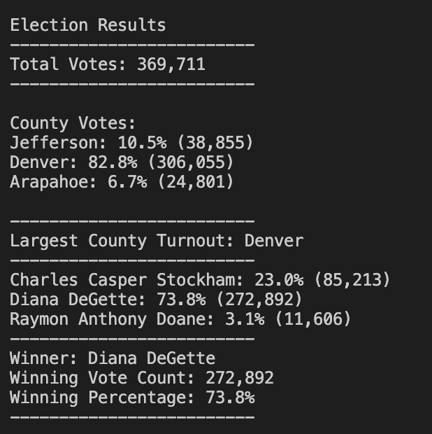
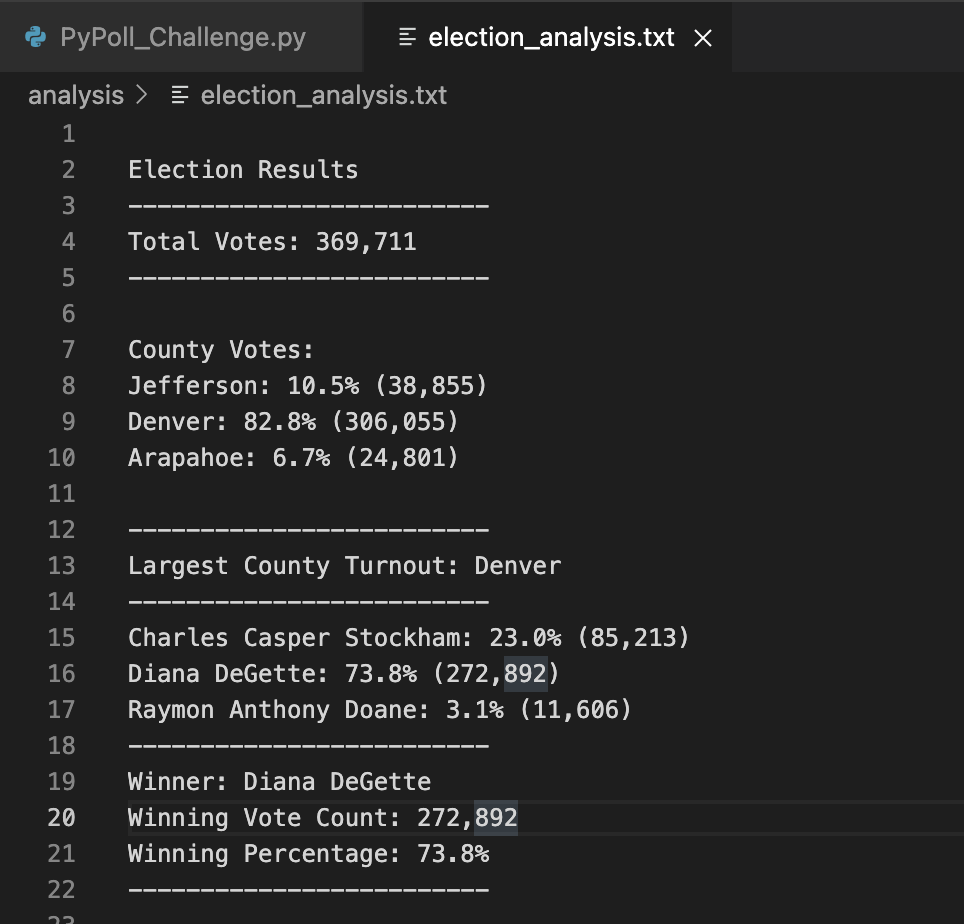

# Election Analysis

## Overview of Project
The project is to go over the tasks that need to be completed for the election audit, and discuss the information needed by the Colorado Board of Elections. After successfully submiting the election audit results to the election commission, the election commission has requested some additional data to complete the audit:

- The voter turnout for each county
- The percentage of votes from each county out of the total count
- The county with the highest turnout 

Finally, need to provide a written analysis of the election audit for the election commission, including the new results and a clearly written overview of the methods.As with all written analyses, this will help your audience understand what you did and what they might be able to do with the data you presented.

## Results & Analysis
This project consists of two technical analysis deliverables and a written report to deliver the results.

Deliverable 1: The Election Results Printed to the Command Line

Deliverable 2: The Election Results Saved to a Text File

Deliverable 3: A written Analysis of the Election Audit (README.md)

**Deliverable 1**

Using repetition statements, conditional statements with logical operators, and print statements, printed out the candidate and county election results to the command line. After running the solution to Deliverable 1, the output to the command line gave us the election results as shown in the screenshoot below :

**Deliverable 2**

Writing script to print the winning candidate results and the county election results to the election_results.txt file.

The below screenshot shows the results/output of election analysis written into a text file.
 

**Deliverable 3**

Deliverable is this README.md file which consists of the written analysis of the election Audit.

## Summary
This project is intended to provide the election commission the results of an election. Along with the results it aslo provide total voter count for each county, the percentage of votes from each county of the total count & the county with highest turnout. 

This project can be used to get the results of any election data, minor edit are required for the code to run on any election data.

- Input file path needs to be changed on line #9 of file PyPoll_Challenge.py. This is the file which contains the dataset for the election.
- Output file path needs to be changed on line #11 of the file PyPoll_Challenge.py. This is the file to which the results will be written.

## Future Enhancements

The following modifications can be made to the program to improve the user experience of the customer

- The program can be modified to take the path of the input dataset and the output results file as command line parameters or via pop up dialogue boxes where the user can select the dataset.
- Graphical representation of the election results can be provided in the form of pie charts and bar graphs.

